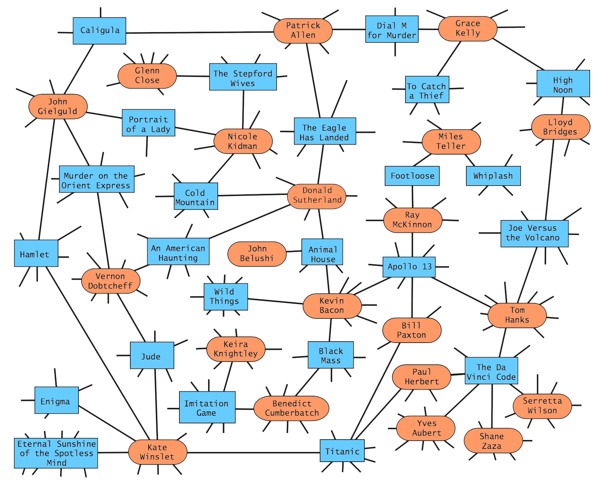

# Guess The Actor!

Website: http://guesstheactor.alvinthai.net/

### Description

This project is a movie trivia application that utilizes graph theory on an [imdb](https://github.com/alvinthai/guess_the_actor/blob/master/data/imdb_edges.tsv) dataset to quiz users on guessing an actor common to two movies.


Degree centrality is used to count the number of edges adjacent to the actor node. The degree of the actor node is used to rank how frequently the actor appears among movies in the imdb dataset, and the difficulty setting of the game filters movie pairs based on the common actor's degree centrality ranking:

| DIFFICULTY | ACTOR CENTRALITY RANKING |
|------------|--------------------------|
| Hard       | Top 1%                   |
| Brutal     | Top 5%                   |
| Agony      | All                      |

Additionally, this application incorporates fuzzysearch with [MassAutocomplete](https://github.com/hakib/MassAutocomplete) for Angular.js to assist users in spelling the actor's name correctly.

### Instructions to run on local computer
1. Install the anaconda python 2.7 distribution
2. Clone this repo
3. Run this command in terminal:  
  ```
  python webapp.py
  ```
4. Go to this address in your web brower:  
  ```
  0.0.0.0:8000
  ```
5. You will be presented with two movies. Guess the actor who is credited in both movies!  
  

### Package Dependencies
* flask
* networkx
* numpy
