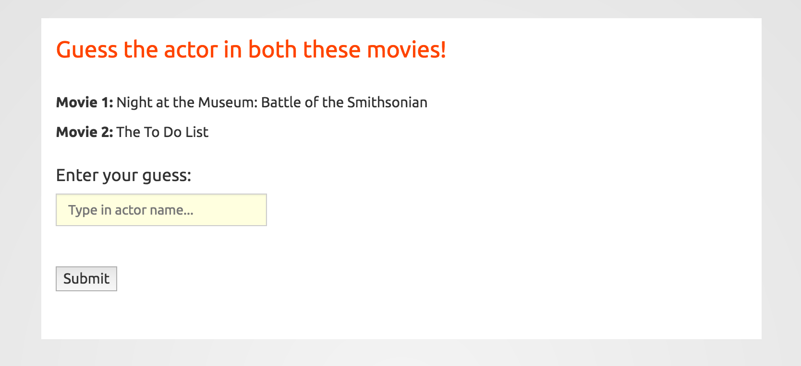

# Guess The Actor!

### Instructions to run
1. Clone the repo
2. Run this command in terminal:  
  ```
  python webapp.py
  ```
3. Go to this address in your web brower:  
  ```
  127.0.0.1:5000
  ```
4. You will be presented with two movies. Guess the actor who is credited in both movies!  
  
5. When you are done playing, close the server by pressing CTRL+C in terminal.
